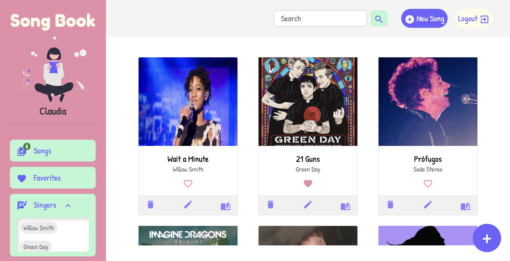

# SongBook App

This is a Song Book App using MERN stack.

## Table of contents

- [Overview](#overview)
  - [Screenshot](#screenshot)
  - [Links](#links)
- [My process](#my-process)
  - [Built with](#built-with)
- [Author](#author)

## Overview

### Screenshot

### Links

- [Solution URL](https://github.com/claurey/songbook-app)
- [Live Site URL](https://claurey.github.io/stats-preview-card-component/)

## My process

### Built with

- React, React Router V6
- Node.js and MongoDB
- Bootstrap , Material UI

### Run app
npm install
npm run start

## Author

- Website - [https://github.com/claurey](https://github.com/claurey)
- Twitter - [@claurey591](https://www.twitter.com/claurey591)